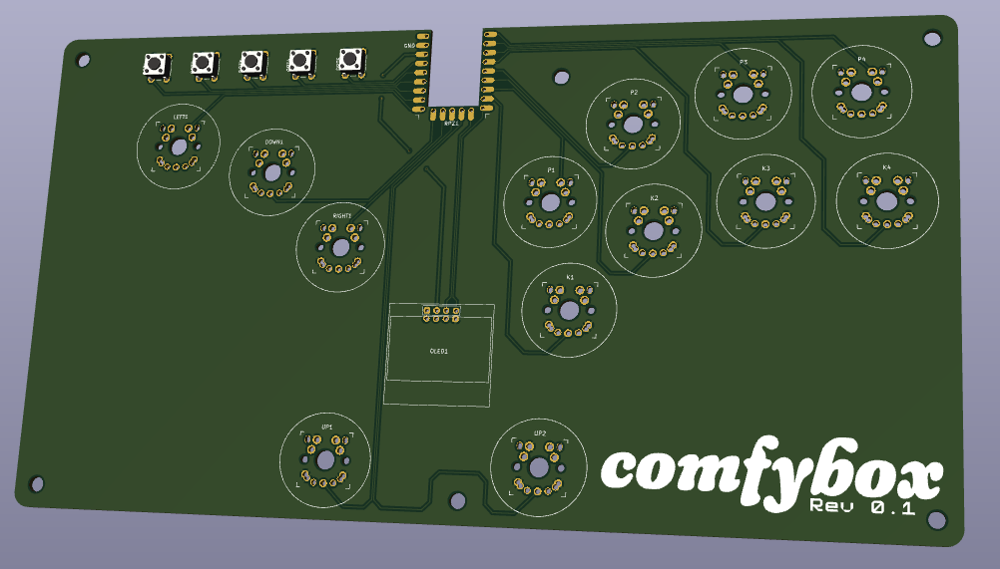

# 

A stickless fighting game controller, intended to be more ergonomic compared to the regular stickless style layout.

## Features

- Split and 16° angled buttons for improved ergonomics
- Compatible with Kailh Choc v1/v2, Gateron Low Profile 1.0/2.0 and regular MX
- Completely reversible PCB for southpaw layout
- OLED screen
- Powered by [GP2040-CE](https://github.com/OpenStickCommunity/GP2040-CE)
  - Button remapping
  - SOCD Modes
  - XInput, DirectInput and Nintendo Switch
  - Web UI
